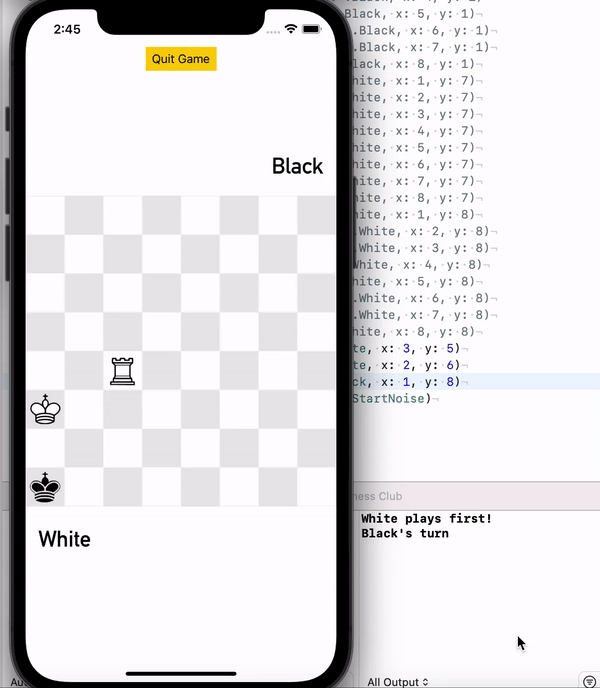

# Chess Club

Final creative project for CSE438: chess iOS app from scratch. Doesn't account for rules of stalemate, castling out of check, en passant capture for pawns, and pawn promotion. Otherwise, it is a fully functional chess game that doesn't allow any illegal moves and assesses checkmate correctly for every situation I've tested. Doesn't allow moves that would place the king in discovered check, or when a king is placed in check, moves that would fail to get the king out of check. Pawns have a different attack pattern than their normal move.
Clean and intuitive drag-and-drop UI along with appropriate sounds used by chess.com for every move, check, capture, castle, and checkmate.
All game logic is contained in [Board.swift](https://github.com/caberghausen/chessClub/blob/main/Chess%20Club/Board.swift).

## Move validation

## Checkmate

## Discovered check

## Pawn movement
