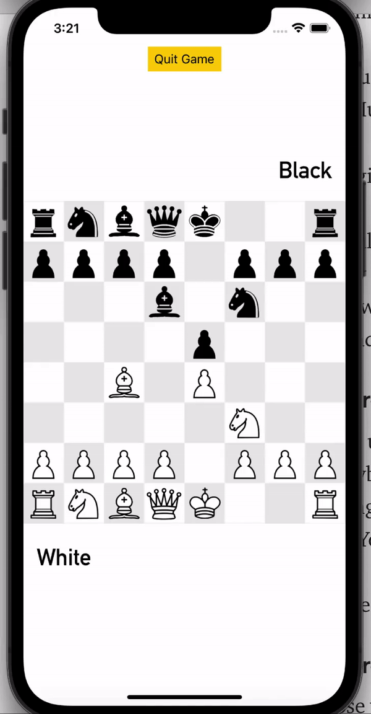
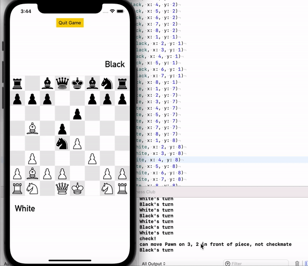
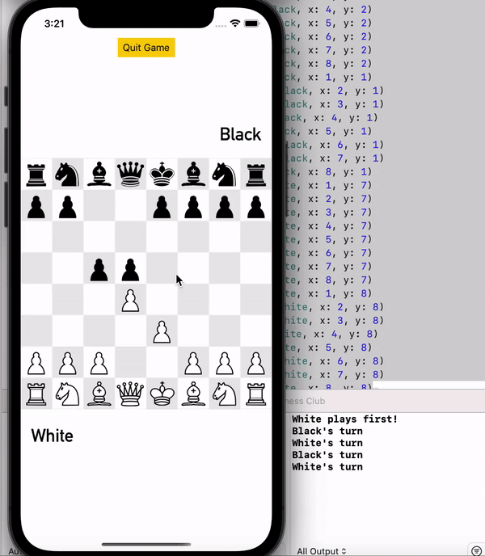

# Chess Club

Final creative project for CSE438: chess iOS app from scratch. Doesn't account for rules of stalemate, castling out of check, en passant capture for pawns, and pawn promotion. Otherwise, it is a fully functional chess game that doesn't allow any illegal moves and assesses checkmate correctly for every situation I've tested. Doesn't allow moves that would place the king in discovered check, or when a king is placed in check, moves that would fail to get the king out of check. Pawns have a different attack pattern than their normal move.\
Clean and intuitive drag-and-drop UI along with appropriate sounds used by chess.com for every move, check, capture, castle, and checkmate.\
All game logic is contained in [Board.swift](https://github.com/caberghausen/chessClub/blob/main/Chess%20Club/Board.swift).

## Move validation

## Checkmate

## Discovered check

## Pawn movement

### Cross-device play

Cross-device play was a reach goal that was close to functionality using socket.io for Swift, running two XCode simulators at once, and running a node.js on localhost via terminal. It has bugs with switching turns on each device and I did not take time to perfect it because I think the local play game mode by itself is quite cool. However, in the remote chance you have Xcode installed, wanted to clone this repo, and wanted to see it in action, here are the instructions:

1. Open Chess Club.xcodeproj in the ChessClub folder because this will take a second to load the socketIO dependencies

2. You'll need Node.js and npm installed - I had them installed from taking cse330 but you can install both of them simultaneously at https://nodejs.org/en/download/ 

3. Open terminal and navigate to the directory ChessClubServer. You should be able to type $< ls > and see three files.

4. You may need to run $< npm install > before the next step to install dependencies. I tried it without running this command and it worked for me.

4. Run $< node server.js >. The socket should now be listening at localhost:8900; you can terminate it with ^C

5. Build & run an instance of the Chess Club xcode project for both an iPhone 12 Pro and an iPhone 11 Pro. This will open up two simulator windows.

6. Click online play for each device. The device you start on first will be White and will go first.

7. You can mess around with it a bit but it never switches turns from White and only actually moves a piece on the opposite device every couple of moves. But it was close to working and I think the bug is all client-side, having to do with how I switch turns. It got messy because I had all my game logic in the Board class but needed a way to disable moving the opponent's pieces in online play.
